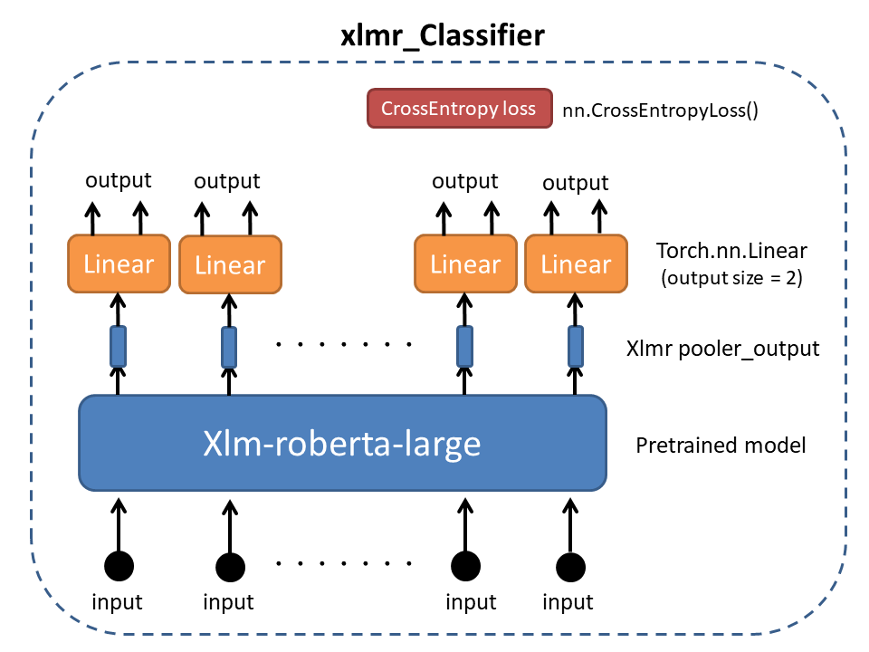

# XLM-RoBERTa Fine-Tuning for Text Classification

## Environment : 
- Python 3.6.9
- Pytorch 1.7.0

## Pretrained model :
- Name : "xlm-roberta-large"
- Unfreezed layer : layer.18 - layer.24,   xlmr.pooler_output

## Model



## Data
 - Input : Artical text
 - Input size : tokenizer(max_length=512)

|Positive|Negative|Total|
|:-:|:-:|:-:|
|544|569|1113|

## Training
 * Parameter
    * BATCH_SIZE : 6
    * EPOCHS : 20
    * LEARNING_RATE : 2e-6 
 * Dataset
 
| |Positive|Negative| &nbsp; &nbsp;Total &nbsp; &nbsp;|
|:-:|:-:|:-:|:-:|
|**Train**|323|344|667|
|**Validation**|107|116|223|
|**Test**|114|109|223|

## Result
* Accuracy :  0.896861

|-|True Positive|True Negative|False Positive|False Negative|
|:-:|:-:|:-:|:-:|:-:|
|**Test**|105|95|14|9|

To get detailed process in every epoch, run tensorboard in the `transformer` file
 ```
 $ tensorboard --logdir tensorboard --bind_all
 ```
